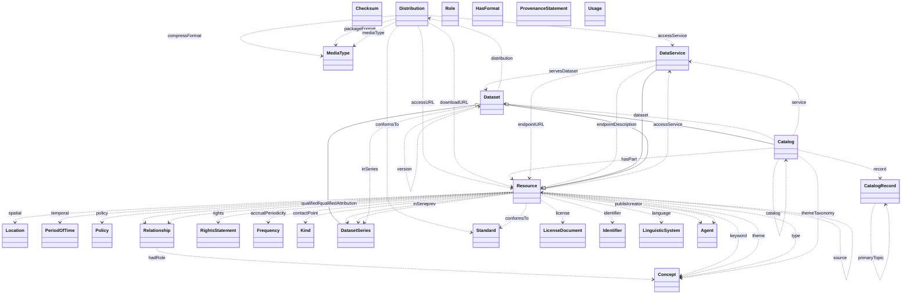

# DCAT-AP Builder (Full Stack)

This repository provides a full-stack solution for converting Excel files to DCAT-AP RDF with SHACL validation.
It now features a **FastAPI backend** and a modern **web frontend**.

## Architecture

- **Frontend**: Lightweight HTML/JS application (`frontend/`).
- **Backend**: Python FastAPI service (`backend/`) that orchestrates the conversion pipeline.
- **Pipeline**: Uses Dockerized tools (RMLMapper, PySHACL) for robust RDF generation and validation.

## Ontology Visualization

Below is the class diagram for the `constructDCAT` extension ontology included in this repository.



## Quick Start

### 1. Backend
```bash
cd backend
pip install -r requirements.txt
python main.py
```
The API will be available at `http://localhost:8000`.

### 2. Frontend
Open `frontend/index.html` in your browser.

## Directory Structure

```
.
├── backend/                # FastAPI application and core logic
│   ├── ontology/           # DCAT-AP extensions (constructDCAT.ttl)
│   ├── shacl/              # SHACL constraints (constructDCAT_shacl.ttl)
│   ├── run.sh              # Conversion pipeline script
│   └── main.py             # API Entrypoint
├── frontend/               # Web Interface
│   ├── index.html
│   ├── style.css
│   └── app.js
└── .github/workflows/      # CI/CD Configuration
```

## Development
This project follows a standard branching model.
- **main**: Stable production code.
- **development**: Active development branch.

### Testing
Run the backend tests or manually verify using the frontend.
Changes to the repo are automatically tested via GitHub Actions.
